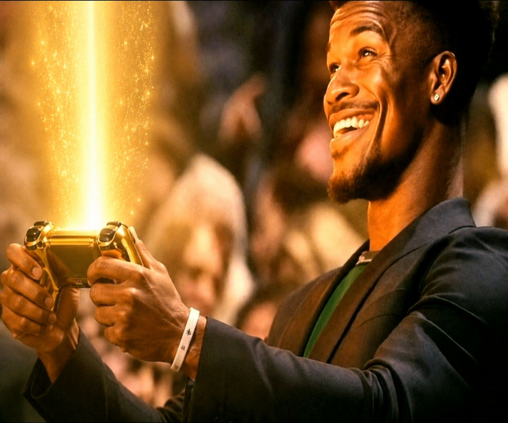
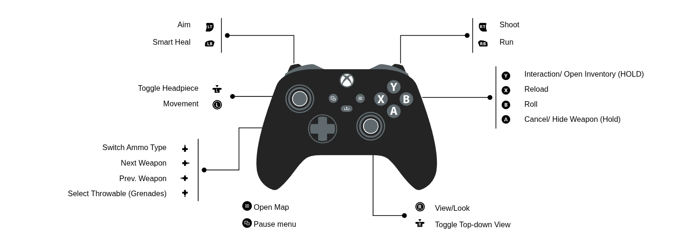
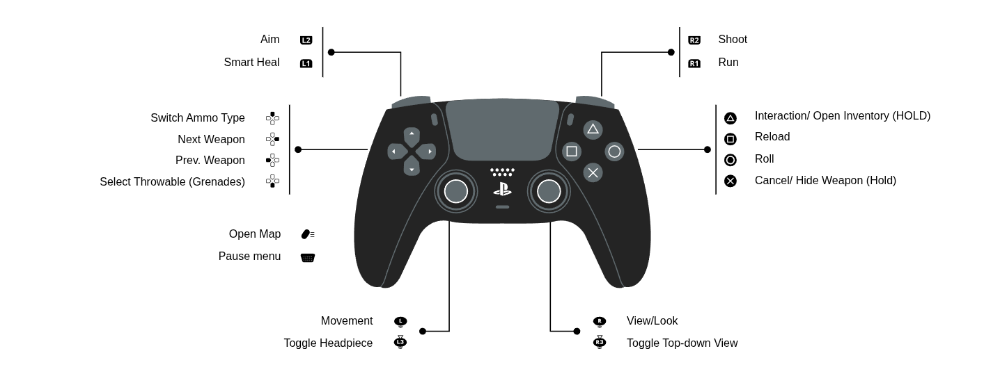
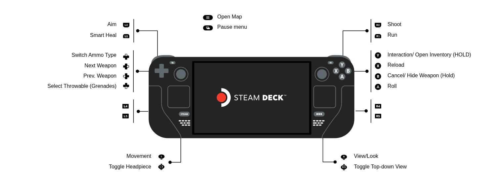

<div align="center">



# Golden Controller

**Full, native-feel controller support for [Escape from Duckov](https://store.steampowered.com/app/3167020/).**

A ground-up controller implementation built on the game's own Unity
InputSystem — twin-stick combat, deterministic menu navigation across every
screen, on-screen glyphs, and fully rebindable controls. Plays like the game
shipped with a gamepad in mind.

[**▶ Steam Workshop**](https://steamcommunity.com/sharedfiles/filedetails/?id=3742900289) &nbsp;·&nbsp; [Releases](../../releases) &nbsp;·&nbsp; [Report a bug](../../issues/new/choose)

</div>

---

## Why

Escape from Duckov is a twin-stick extraction shooter with deep, mouse-driven
menus — inventory grids, loot, trading, crafting, base-building, a map, even
arcade minigames. Out of the box none of that is reachable from a pad. Golden
Controller wires a controller into **all of it**, without a clumsy virtual
mouse cursor and without breaking keyboard + mouse (both work at once —
whichever you touched last wins).

## Features

### Combat & aim
- **Twin-stick aiming** with an absolute-radial cursor, configurable deadzones,
  sensitivity, and response curve. Separate ADS sensitivity.
- **Tiered aim assist** — pick a preset or tune every knob:
  `Off` → `Light` → `Standard` → `Aggressive` → `Cheat` → `Custom`. Default is
  **Standard** (magnetism + slowdown near targets, no hard lock).
- **Recoil assist & target lead** that work *with* the game's own soft-aim cone
  instead of fighting it, with an escapable soft-lock so you stay in control.
- **Throwables** — cycle with D-pad, hold to aim with free stick pan inside cast
  range, release to throw, auto-return to your weapon.
- **Melee** face-snap to the nearest enemy.
- **Scoped weapons** — free-look while scoped with an escapable assist.

### Menus & navigation (every screen)
- Deterministic **stick / D-pad focus stepping** between slots — no virtual
  cursor. The game's own hover/click handlers fire exactly as the mouse would.
- Full controller nav for **inventory, loot, traders, crafting, repair,
  dismantle, ATM, base-building, the minimap, note index, skill trees,
  character creation, the main menu**, and the arcade **minigames**.
- Drag-and-drop, stack split, item lock, quick-use, and context menus — all on
  the pad.
- **On-screen controller glyphs** that show the right button per screen
  (Xbox / PlayStation / Steam Deck families).

### Quality of life
- **Fully rebindable** — every binding is a Unity control-path string in
  `Settings.json`, hot-reloaded on save (no restart).
- **Haptics** for UI and gameplay (toggleable).
- **No native OS calls** — everything goes through Unity InputSystem, so it
  works under gamescope, Wayland, X11, Proton, and Windows.
- **Coexists with keyboard + mouse.**

## Control scheme

Defaults shown per controller family. Every button is rebindable.

**Xbox**



**PlayStation**



**Steam Deck**



<details>
<summary>Text reference (Xbox layout)</summary>

**In game** — Left stick move · Right stick aim · RT fire · LT aim down sights ·
RB sprint · A dash · X reload · Y interact · B put away / cancel · LS night
vision · RS toggle view · D-pad ↑↓ switch weapon · D-pad ←→ switch ammo /
interact · Start inventory · Select map.

**In menus** — D-pad / left stick move focus · A select / confirm · B back /
close · X context action · Y item menu (hold for details) · LT / RT switch pane
· LB / RB previous / next page or tab.

</details>

## Install

### Steam Workshop (recommended)
Subscribe on the Workshop: **[Golden Controller](https://steamcommunity.com/sharedfiles/filedetails/?id=3742900289)**.
Enable it in the in-game Mods menu if it isn't active, then restart. Harmony is
bundled — no other subscriptions required.

### Manual (drop-in zip)
1. Download the latest `GoldenController_<date>.zip` from [Releases](../../releases).
2. Browse to your game folder (Steam → right-click *Escape from Duckov* →
   Manage → Browse local files).
3. Copy the `GoldenController` folder from the zip into
   `Duckov_Data/Mods/` (create `Mods` if it doesn't exist).
4. Launch, plug in a controller, enable the mod in the Mods menu if needed.

`INSTALL.txt` inside the zip has the full walkthrough.

## Configuration

All settings live in `Settings.json` next to the DLL and **hot-reload on save**.

| Key | What |
|---|---|
| `AutoAim.Tier` | `Off` / `Light` / `Standard` / `Aggressive` / `Cheat` / `Custom` |
| `Aim.*` | Sensitivity, deadzones, response curve, magnetism, slowdown |
| `Bindings.*` | Every binding as a Unity control-path string |
| `Ui.*` | Nav repeat timing, drag hold threshold, focus outline |
| `Haptics.*` | Rumble enable / intensity |

## Build from source

The mod references the game's own managed assemblies, which are **proprietary
and not redistributed here**. You supply them from your own copy of the game.

```bash
# 1. Provide the game DLLs the project references (see the csproj <Reference> list):
#    copy them from  <Escape from Duckov>/Duckov_Data/Managed/  into  reference/managed/
#    and drop a Harmony build at  reference/HarmonyLib_workshop/0Harmony.dll
# 2. Build
dotnet build src/DuckovController/DuckovController.csproj -c Release
# -> build/DuckovController.dll

# 3. Package a drop-in zip (optional)
dist/package_release.sh   # -> dist/release/GoldenController_<date>.zip
```

See [`reference/managed/README.md`](reference/managed/README.md) for the DLL
list and where to find them.

## Requirements

Escape from Duckov **V1.x** (Unity 2022.3, Mono). No other mods required.

## Credits & licenses

- Mod code: **MIT** — see [LICENSE](LICENSE).
- [Harmony](https://github.com/pardeike/Harmony) (runtime patching) — MIT,
  bundled.
- Controller glyphs: **[Kenney Input Prompts](https://kenney.nl/assets/input-prompts)** — CC0.
- *Escape from Duckov* and its assets are © TeamSoda. This is an unofficial,
  fan-made mod and is not affiliated with or endorsed by TeamSoda.
